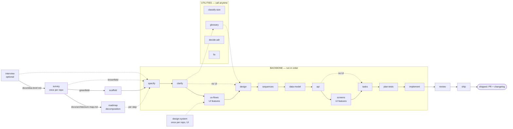

# SDD — Spec-Driven Development for Claude Code

A self-contained Claude Code plugin that carries a feature from a one-line idea to
**reviewed, verified, shipped** code through **22 atomic, stack-agnostic skills** and a
**TDD implementation engine** — with a living roadmap above the per-feature flow and a
**design pipeline** (design-system · ux-flows · screens) for UI features.

Every skill is Socratic (it walks decisions with you, it doesn't dump a wall of output),
gated (a stage hard-refuses when its prerequisite artifact is missing), and stack-agnostic
(no language, tracker, or test tool is hard-coded — the skills detect what your repo uses).
The Q&A skills (`specify` / `clarify` / `design`) are also **depth-tunable** — an easy / medium / hard
dial decides how much the skill decides for you vs. interrogates you with trade-offs.

## Requirements

SDD runs on **any Claude plan / model tier** — no skill requires a specific model:

- Skills declare `model: inherit` and run on your **session model** — run your SDD session on the
  strongest tier your account has.
- The **judgment agents** (reviewer / critic / devils-advocate / strategist / analyst) *default*
  to `opus`. No Opus access? Set `judgment_model: sonnet` in `.claude/sdd.local.md` — the
  supported path. Fable access? The floor rule lifts judgment to your session model automatically,
  or pin `judgment_model: fable` explicitly.
- A model tier that turns out unavailable **degrades, never blocks**: the dispatch retries once on
  the session model and says so ([`skills/_shared/agent-roster.md`](./skills/_shared/agent-roster.md)).

## Install

**Claude Code** — native plugin:

```text
/plugin marketplace add genkovich/sdd
/plugin install sdd@sdd
```

After updating to a new release: re-run `/plugin install sdd@sdd`, then `/reload-plugins`.

**Codex CLI** — `cd` into your project first: the script installs into the **current directory**
(`.agents/skills/` + `.codex/agents/`). Add `--global` after `codex` to install under `~` instead,
or `--prefix DIR` to install under an arbitrary directory (useful for trying it out in a sandbox):

```sh
cd your-project
curl -fsSL https://raw.githubusercontent.com/genkovich/sdd/main/install.sh | bash -s -- codex
```

Then restart codex (skills are discovered at session start) and type `$sdd-specify`.

Alternative — the plugin marketplace. Note that `add` only **registers** the marketplace, it
installs nothing by itself:

```text
codex plugin marketplace add genkovich/sdd
```

then **inside codex** run `/plugins`, switch to the `sdd` marketplace tab and pick
**Install plugin**. One naming nuance: the marketplace install registers the **original** skill
names (`$specify`), while the installer script prefixes them — `$sdd-specify` — because bare
names like `review` / `design` / `api` collide with generic skills. **Pick one of the two paths,
not both** — they register different names for the same skills, so running both shows every
skill twice. To undo the script install: re-run `install.sh codex --uninstall` from the same
directory (or with the same `--global` / `--prefix`). To undo the marketplace install: `/plugins`
→ the sdd tab → uninstall (or remove the `[plugins."sdd@…"]` entry from `~/.codex/config.toml`).
The script warns when it detects a marketplace install already registered.

> **Windows note.** The installer is a bash script — run it from Git Bash or WSL. The directories
> it writes (`.agents/`, `.codex/`, `.cursor/`) start with a dot, which Explorer hides by
> default — enable «Hidden items» (or `dir /a`) to see them.

**Cursor** (2.4+) — the same script; `cd` into your project first (installs into
`.cursor/skills/` + `.cursor/agents/` of the current directory; `--global` for `~`,
`--prefix DIR` for an arbitrary directory):

```sh
cd your-project
curl -fsSL https://raw.githubusercontent.com/genkovich/sdd/main/install.sh | bash -s -- cursor
```

Then restart Cursor (or run **Developer: Reload Window**) and invoke a stage by typing `/` in
the chat and picking `sdd-specify`. (Cursor also reads `.agents/skills/`, so a Codex install is
already visible to Cursor.) Once the plugin is listed on the Cursor marketplace, installing from
the in-app marketplace panel works too — project- or user-scoped.

How every Claude-specific mechanism — `AskUserQuestion`, subagents, `/clear`, the implement
engine modes — maps to Codex / Cursor is one table:
[`skills/_shared/tool-adapters.md`](./skills/_shared/tool-adapters.md).

## Start here

The flow is a straight line: **each stage writes a file the next one reads.** Run them in order
(the diagram + table are just below).

```text
/sdd:survey                         ← once per repo: map an existing codebase, OR bootstrap an empty one
/sdd:specify checkout-discounts     ← interviews you, writes the spec (you don't bring one)
/sdd:design … → /sdd:implement … → /sdd:review … → /sdd:ship
```

Two things to know up front: **`survey` runs once per repo** — on an existing codebase it maps the
current architecture to `docs/architecture-map.md` (every later stage reads it); on an empty repo it
runs a short foundation session and scaffolds the skeleton ([detail below](#where-we-study-the-codebase--hold-the-current-architecture)).
And **`specify` *creates* the spec** from a short interview — you bring the idea, not the document.

From there you walk the backbone in order. Each step reads the previous step's file and
refuses if it's missing, so you can't skip ahead by accident.

**Every stage ends with a copy-ready handoff block** ([`skills/_shared/handoff.md`](./skills/_shared/handoff.md)):
*What I did* + *Review before continuing* (links to the files it wrote, so you can eyeball them at the
gate) + *Run next* — **`/clear`**, then the next `/sdd:…` command in a fenced block you copy in one
click. The `/clear` matters because each stage is gated and **re-reads its inputs from disk**, so it
needs no carryover — clearing keeps the context small and stops one stage's chatter from drifting into
the next. (Loop-backs are the exception — when `review` bounces back to `implement`, you stay in
context to iterate; utilities make `/clear` optional.) It looks like this:

```md
## ✅ specify — checkout-discounts

**What I did**
- wrote docs/features/checkout-discounts/spec.md — size M (from .size); proposed commit `spec: checkout-discounts`

**Review before continuing**
- docs/features/checkout-discounts/spec.md — goals, user stories, the §5 acceptance criteria

**Run next**
1. /clear — mandatory (fresh context; the next stage re-reads its inputs from disk)
2. then run:  /sdd:clarify checkout-discounts
```

## The flow

There are three kinds of skill. Most of your time is the **backbone** — a straight line you
walk in order. A few are **utilities** you call whenever you need them. Two **close the loop**
after the code is written.



### Step 0 — survey (once per repo, before the backbone)

| # | Skill | What it does | Reads → Produces |
|---|---|---|---|
| 0 | **survey** | Existing repo → scans once, persists the current architecture. Empty repo → level-adaptive foundation session → fixes the foundation + emits a scaffold `tasks.json` for `scaffold`. | the repo → `docs/architecture-map.md` (+ scaffold `tasks.json` on greenfield) |
| 0b | **scaffold** | *Greenfield only:* materializes the skeleton the foundation planned — sequentially inline, anchored on the **skeleton smoke test** (builds + boots + empty test suite + migration tool) | `architecture-map.md` + `_scaffold/tasks.json` → the committed skeleton |
| 0c | **design-system** | *Once per repo, before the first UI feature:* fixes the committed design canon — the drawing tool (Figma / Pencil / code), platform posture, tokens, component inventory | the repo (+ design MCPs) → `docs/design-system.md` |

### Backbone — the straight line (run in order)

| # | Skill | What it does | Reads → Produces |
|---|---|---|---|
| 1 | **specify** | Interviews you to capture the idea, writes the product spec + acceptance criteria (reads the architecture map for constraints) | *your idea*, `architecture-map.md` → `spec.md` |
| 2 | **clarify** | Sweeps the spec for ambiguities (a devil's-advocate pass), closes or defers each | `spec.md` → tightened `spec.md` |
| 3 | **ux-flows** | *UI features only (auto-skipped otherwise):* derives one user flow per UI-touching user story (happy + AC-driven error branches) + the `SCR-NN` screen inventory — always markdown+mermaid, whatever the design tool | `spec.md`, `design-system.md` → `ux-flows.md` |
| 4 | **design** | **Matches the feature to your existing architecture** (see below) + **declares the target surfaces** (reading `ux-flows.md` as evidence), writes the Arc42 SAD + C4 + ADRs | `spec.md` (+ `ux-flows.md`, `CONTEXT.md` if present) → `sad.md`, `adr/*` |
| 5 | **sequences** | Draws the runtime flows as Mermaid sequence diagrams (UI-driven flows agree with `ux-flows.md`) | `sad.md` → `sad.md §6` |
| 6 | **data-model** | Designs the schema and writes the actual forward+rollback migrations — **staged** under the feature folder, not the live tree (`implement` promotes them) | `spec.md`, `sad.md`, sequences → `data-model.md`, staged `migrations/*.up/down.sql` |
| 7 | **api** | Derives the OpenAPI contract from the data model (or the existing schema on the fast lane) + sequences + spec | `data-model.md`, sequences, `spec.md` → `contracts/openapi.yaml` |
| 8 | **screens** | *UI features only (auto-skipped otherwise):* the canonical screen manifest — every screen in every state (default / loading / empty / error / …), reuse-first components; drawn per the canon's tool (Figma / `screens.pen` / inline wireframes) | `ux-flows.md`, `sad.md`, contracts, `design-system.md` → `screens.md` |
| 9 | **tasks** | Breaks the work into atomic ≤1-day tasks + a `tasks.json` dependency DAG (each `ui` task cites `screens.md` SCR ids + states) | all of the above → `tasks/*`, **`tasks.json`** |
| 10 | **plan-tests** | Maps every acceptance criterion to ≥1 test (inline in the spec for XS/S; e2e-through-UI paths from `ux-flows.md`, component states from `screens.md`) | `spec.md`, `data-model.md` → `test-plan.md` (M+) or an inline `## Test plan` in `spec.md` (XS/S) |
| 11 | **implement** | The TDD engine: writes a failing test, makes it pass, gates, commits — per task; **promotes** each staged migration into the live `migrations/` as it builds; a `ui` task builds to the `screens.md` states, reusing the inventory | `tasks.json` + all artifacts → code + tests + promoted migrations, committed |

### Close the loop (after the code is written)

| # | Skill | What it does | Reads → Produces |
|---|---|---|---|
| 12 | **review** | An **independent, clean-context** code review of the *whole* change against spec/AC + quality (incl. built-screen ↔ `screens.md` match) | the diff + `spec.md` → review record, `PASS` / `CHANGES REQUESTED` |
| 13 | **ship** | **Verifies the feature actually runs** (not just green tests), writes the changelog, opens the PR | the reviewed change → changelog + PR (never auto-merges) |

`review` can bounce back to `implement` if it finds an unmet acceptance criterion. `ship` is the
end: a reviewed, verified change with a changelog and an open PR — merging to main stays your call.

> **"We test and review, right?"** Yes — in two places. `implement` runs a **per-task gate**
> (unit + integration + lint + vet) on every task as it goes, so each task is green before it's
> committed. Then `review` does the **independent, whole-change** code review a human reviewer
> would do on the PR, and `ship` **runs the feature for real** against its acceptance criteria.
> Tests-pass happens continuously inside `implement`; the cross-cutting review + real-world
> verification are the explicit `review` and `ship` steps.

### Utilities — call whenever you need them (not part of the line)

- **interview** *(before roadmap / specify)* — gets the idea **out of your head and onto disk**: a Socratic pass that surfaces hidden assumptions, names tradeoffs and proposes sharper angles, then writes the 8-section `docs/idea-brief.md` (raw idea · problem · users · why now · out of scope · risks · recommendation · open questions). That file is what `roadmap` refuses to start without — the repo holds what an agent can read for itself, the brief holds what only you know. Any idea, not just features; outside a git repo it stays talk-only and writes nothing.
- **classify-size** — size the feature XS/S/M/L/XL (writes `.size`); later skills read it to decide MVP vs full depth. Run it at the start, or any time scope changes.
- **design-system** *(once per repo, before the first UI feature)* — fixes the **committed** design canon `docs/design-system.md`: the drawing tool (**Figma MCP / Pencil MCP / `code`** — markdown wireframes), the platform posture, the token source, the component inventory. `ux-flows` reads the posture, `screens` draws per the tool, `implement` registers `NEW` components back into it.
- **glossary** — capture a domain term in `CONTEXT.md` with a definition. Run it whenever a new term shows up; `design` and the spec read the glossary.
- **decide-adr** — write a standalone ADR after the fact, when `tasks` (or a review) flags a decision that needs recording but wasn't captured during `design`.
- **fix** — the **bugfix entry point**: reproduce, trace the symptom to the spec's acceptance
  criteria (regression / ambiguous AC / uncovered gap), pin it with a failing test, apply the
  minimal fix through the same gate `implement` runs, then patch the spec and write a fix record
  under `_fixes/`. Works on a repo with no specs at all (fixes code-first, recommends `survey`).

## Interview depth (easy / medium / hard)

The Q&A skills open by setting a **depth dial** — one `AskUserQuestion` per run that tunes how much
the skill decides on its own vs. interrogates you. It changes *how many* questions you get, never
*what gets covered*:

- **easy** — the skill makes the reversible, low-stakes calls itself with sensible defaults, asks
  only the irreversible / high-blast-radius ones, and **lists every assumption it made** so you can
  veto. Minimal analyses; diagrams written + summarized (no per-item question).
- **medium** (default) — the balanced Socratic walk: one question per real decision.
- **hard** — walk every decision with the trade-off foregrounded, run the **full ideation analysis
  suite** (competitive research, three strategic approaches, multi-perspective review,
  devil's-advocate), and probe edge cases harder.

The default is `interview_depth` in `.claude/sdd.local.md` (else medium); override it per run, or
pass `--depth=easy|medium|hard`. Full semantics: [`skills/_shared/interview-depth.md`](./skills/_shared/interview-depth.md).

Two things the dial **never** weakens — they hold at every level:

- **Readable diagrams.** `design` and `sequences` confirm each diagram **in prose** (a plain-language
  walk of the flow + branches) and write the source to the file (where Obsidian renders it) — they
  **never dump raw Mermaid into the terminal** as the thing to approve. If `mmdc` is installed, an
  image is rendered too. ([`skills/_shared/diagram-presentation.md`](./skills/_shared/diagram-presentation.md))
- **Full use-case + acceptance-criteria coverage.** Every spec §4 user story and §5 AC is covered
  end-to-end: `specify` enforces a **use-case floor** (every user story carries ≥1 AC) and `clarify`
  re-catches a story that lost it; `sequences` maps each user story to a flow and each AC to a flow,
  a branch, or an explicit non-runtime N/A (no flow cap); and `review` traces the whole set through
  spec → sequences → data-model → api → tasks → implement, flagging anything that dropped out. Even
  `easy`/XS covers every use-case + AC — it just asks fewer questions about *how*.

## Target surfaces (what's being built)

`design` opens §4 by declaring the feature's **target surface(s)** — *what's being built* — grounded
in C4 container types: `backend-service`, `web-frontend` (SSR or SPA), `mobile-app`, `desktop-app`,
`cli`, `worker`, `library-sdk`. The choice is derived from the spec's "for whom" (the spec stays
product-level — it never names a surface), gated by the blast-radius gate (multi-surface usually
spawns an ADR), drawn as **one C4 container per surface** in SAD §5, and written to the SAD
frontmatter `target_surfaces: [...]`. Downstream stages **read** that declaration and gate their
output by it — they never re-derive it:

- **`api`** picks the contract form from the surface (HTTP/OpenAPI · gRPC · events · `cli.md` ·
  `public-api.md`); a UI surface *consumes* the backend contract rather than authoring one.
- **`sequences`** draws **UI-driven flows** (`<user>` → `<ui>` → `<service>`) for a UI surface.
- **`tasks`** adds a **`ui`** task layer for a UI surface (backend-only stays domain/infra/app/ports).
- **`plan-tests`** adds the **component / visual-regression / e2e-through-UI** tiers (the frontend
  "testing trophy") for a UI surface; `implement` detects the actual tools (Playwright / Storybook / …).
- **`review`** traces every acceptance criterion through *its* surface — a UI AC to a component /
  e2e-through-UI test, not only a backend one.
- **Reuse, don't reinvent.** `survey` inventories the existing **design system / components / tokens /
  styling** into `architecture-map.md` §Frontend; `design` / `tasks` / `implement` **compose and
  extend** it (modelled on the closest existing screen) instead of hand-rolling new UI — the frontend
  echo of the backend's match-the-repo + copy-the-closest-precedent.

The SAD keeps the **UI-architecture decision** (SSR/SPA, native/cross-platform, state/routing);
**screen-level design lives in the design pipeline** — `design-system` / `ux-flows` / `screens`
(next section). The boundary is two-way: the SAD never duplicates screens, and the design skills
never make architecture decisions. Full semantics:
[`skills/_shared/surfaces.md`](./skills/_shared/surfaces.md).

## The design pipeline (UI features)

Three skills carry a UI feature from user flows to a per-state screen manifest — and are
**auto-skipped end-to-end for backend-only work** (the no-UI N/A conditions in
[`skills/_shared/size-matrix.md`](./skills/_shared/size-matrix.md)):

- **`design-system`** *(utility, once per repo)* — the committed canon `docs/design-system.md`:
  which tool screens are drawn with (**Figma MCP / Pencil MCP / `code`** — inline markdown
  wireframes, always available), the platform posture (mobile-first / desktop-first / responsive),
  the token source, and the component inventory. Committed on purpose — the tool choice is
  team-wide, never in the per-developer `sdd.local.md`.
- **`ux-flows`** *(after `clarify`)* — one mermaid `flowchart` per UI-touching user story (happy
  path + the error branches the ACs demand), the **`SCR-NN` screen inventory**, and an AC→flow
  map. Always markdown+mermaid whatever the tool; `design` reads it as **evidence** for the
  `target_surfaces` declaration.
- **`screens`** *(between `api` and `tasks`)* — the canonical manifest
  `docs/features/<slug>/screens.md`: **every screen in every state** (default / loading / empty /
  error / success / validation), *derived* from the ACs + the sequence branches + the contract
  error responses; per state, the components to **reuse** from the inventory — a `NEW` component
  only with a why-no-primitive-fits justification, registered back into the canon. Visuals per the
  canon's tool: Figma node-refs, a `screens.pen`, or inline wireframes. A missing MCP **degrades
  to `code` mode with a named degradation — never a blocked stage**
  ([`skills/_shared/tool-adapters.md`](./skills/_shared/tool-adapters.md)).

Downstream, the manifest is the contract: `tasks` cites SCR ids + states in each `ui` task,
`implement` builds the screen to the declared states with the named components (new dependencies
only as a last resort, confirmed with you), and `review` checks the built screen against the
approved manifest.

## Where the spec comes from

It's not an input you have to write — **`specify` produces it.** Its interview front asks 3–5
questions about the problem, the users, and what success looks like, then drafts the spec,
validates each acceptance criterion with you, and runs a clean-context critic before writing
`spec.md`. The idea is the input; the spec is the output.

## Where we study the codebase / hold the current architecture

The existing system is studied **once, in `survey`** (Step 0), which persists
`docs/architecture-map.md` — the current architecture: module layout, layering, datastores,
conventions, and a C4 of what exists. That map is the single source of "what's already here":

- **`specify`** reads it so the spec's constraints / non-goals reflect the real system (without
  leaking tech into the acceptance criteria).
- **`design`** reads it and **matches** the feature to that reality — the SAD describes *your*
  system extended, not a greenfield design in a vacuum. It re-scans (via `explorer`) only if
  the map is missing or stale.
- **`data-model`** and **`implement`** read it for the persistence + wiring conventions the new
  code must follow, instead of each re-discovering them.

So you don't re-open "what's the current architecture?" at every stage — `survey` answers it once
and the map carries it. Refresh the map (`survey` again) when the repo has drifted past the
`reflects_commit` it records. In `design`, decisions expensive to reverse cross a blast-radius
gate and become ADRs.

**On an empty project there's no current architecture to study — so `survey` establishes one.**
Its greenfield mode gauges how you want to engage, then picks the stack / structure / data approach
/ conventions with you (defaults-heavy), fixes them as the foundation (the same map, marked
`mode: greenfield-bootstrap`, + foundational ADRs for the irreversible choices), and emits a
scaffold `tasks.json`. **`/sdd:scaffold` then materializes the skeleton** — sequentially inline,
anchored on a smoke test («builds + boots + the test and migration tooling run») rather than
per-folder TDD. After that the repo is real and the per-feature flow builds into it normally.

## The roadmap (the decomposition layer)

The backbone builds **one feature at a time**. `roadmap` is the layer **above** it — one living
`docs/roadmap.md` that breaks the idea into walkable steps, cut with you rather than
by a subagent standing in for you. Scope is whatever you bring: a whole product, an epic, or a
single feature — a small request gets a small roadmap, not a refusal. It runs after
[`survey`](#step-0--survey-once-per-repo-before-the-backbone) when there is a repo to look at, so
the zones in its waves are read off the architecture map instead of guessed; **the map is optional
though** — without one the zones are marked `(new)` and the waves are a first cut to re-cut later.

- **Destination** — one sentence for what is true about the product once the last step ships. The
  steps say how far along we are; this is the only line that says where along.
- **Steps** — vertical increments, each row anchored to the section of the idea-brief/PRD that
  justifies it, sized XS–XL, with a live `Status` (idea / spec'd / building / shipped).
- **A word for what you don't know yet** — `Size` reads `XS…XL` **or** `fog`, one cell, because
  only one of the two can be true: sizing the unformulated is how an estimate becomes a lie. A
  `fog` row waits in `Not yet specified` and trades `fog` for a real size once a recon pass
  sharpens it; `Open decisions` keeps each undecided thing with a type
  (research / prototype / grilling / task) and an owner (agent / human).
- **Dependency graph** — the one place edges live, each with a one-line reason (data model, UI
  zone, auth precondition); no phantom edges that serialize parallelizable work, and no second
  copy in a column that could drift out of sync with the picture.
- **Execution path** — dependency-respecting waves; steps inside one wave are conflict-safe in
  the codebase (different modules / UI zones), so they can run as parallel worktree lanes.

No RICE, no scoring — **order is the prioritization**; no dates outside shipped history. It stays
current because the pipeline updates it: **`specify` marks a step spec'd** (linking the feature
folder) and **`ship` marks it shipped** — delivery itself keeps the roadmap in sync, so it
doesn't rot.

## The implementation engine

`implement` reads `tasks.json`, builds a dependency DAG, and runs a **TDD cycle per task** —
`SELECT → RED → GREEN → REFACTOR → GATE → COMMIT`. It writes a failing test first, proves the
failure is for the right reason, writes the minimal code to pass, keeps refactors green, runs
the gate, and commits with `SDD-Task` / `SDD-AC` trailers.

Three execution modes, chosen automatically from settings + DAG shape (with graceful fallback):

- **Sequential single-agent TDD** — the default and the floor everything degrades to.
- **Agent team** (`team_mode: true`) — `test-author` → `implementer` → `reviewer`
  over the DAG, coordinated through a shared task list, one git worktree per agent.
- **Dynamic workflow** (`workflow_mode: auto`) — a generated `Workflow` pipeline that fans out
  independent tasks up to a parallelism cap.

## Models, effort & agents

Every skill and every agent declares an **execution profile** in its frontmatter — which model,
how much reasoning effort, and which agents it spawns:

```yaml
# a skill's frontmatter
model: inherit     # skills run on the session model; agents pin role-fit tier-alias defaults (haiku|sonnet|opus), overridable at dispatch
effort: high       # low | medium | high | xhigh | max
agents: [critic]   # the agents this skill spawns
```

Model is chosen by the **kind of work**, not by taste:

| Kind of work | Model | Effort | Who |
|---|---|---|---|
| Judgment (spec, design, review, critique, ambiguity, strategy) | `opus` — the **agents'** default, one switch via `judgment_model`; the dispatching skills (specify, clarify, design, review) run on the session model | `high` | `reviewer` / `critic` / `devils-advocate` / `strategist` / `analyst` |
| Execution (write tests, write code) | `sonnet` | `medium` → `high` on escalation | `test-author`, `implementer` |
| Research / gathering (+ web) | `sonnet` | `medium` | `researcher` (competitive / adjacent-solution research) |
| Search / scan / derivation | `haiku` / `inherit` | `low` / `medium` | `explorer`; data-model, api, sequences, tasks |

The nine agents (`agents/`): **explorer** (brownfield scan), **test-author** (failing tests),
**implementer** (makes them pass), **reviewer** (independent review), **critic**
(coherence critique), **devils-advocate** (ambiguity + failure-mode hunt), **researcher**
(competitive / web research), **strategist** (three strategic approaches), **analyst**
(multi-perspective review) — the read-only ones run in **clean isolated context** (fresh eyes) and
emit only cited findings. The last three are the **ideation analyses**, dispatched by `specify` and
gated by the depth dial (easy skips them; hard runs the full suite).

Two policy levers sit on top of the table. **`judgment_model`** (`.claude/sdd.local.md`) moves
**all** judgment agents (`reviewer` / `critic` / `devils-advocate` / `strategist` / `analyst`) in
one switch — its value is open: a tier alias (`haiku | sonnet | opus | fable`), `inherit`, or a
full model id (default `opus`; `sonnet` is the supported path without Opus access) — `agents/*.md`
keep their tier-alias defaults; a per-role `model_<role>` key still wins. The default is a
**floor, not a pin**: with the key unset, a session on a stronger tier than `opus` dispatches
judgment at the session model (an explicit value is always honored literally), and an unavailable
tier degrades — one retry on the session model, never a blocked stage. And on **L/XL** features the
critical verifications — the `reviewer` in `review` and the `critic` in `design`/`specify` — run
at **`effort: xhigh`** (via `CLAUDE_CODE_EFFORT_LEVEL`); the rest of the judgment work stays `high`.

The full policy — override precedence (`env > invocation > model_<role> > judgment_model >
frontmatter > session`), the `.size` scaling, and the env-var fallback for the `effort:` no-op
some builds have — lives in one place: [`skills/_shared/agent-roster.md`](./skills/_shared/agent-roster.md).
Short version: if a run feels under-reasoned, set `CLAUDE_CODE_EFFORT_LEVEL`.

### Configuration — `.claude/sdd.local.md`

The pipeline **auto-creates** this per-project settings file (YAML frontmatter) with **documented
defaults** the first time a skill needs it — normally `specify` at the start — and adds it to
`.gitignore` (it's per-developer). The file is **self-documenting**: every key carries its default,
its allowed values, and a one-line explanation inline. Edit it to change behaviour. Two keys are
**plugin-wide** — `interview_depth` is read by the Q&A skills (`specify` / `clarify` / `design`) to
pre-select the depth dial, and `artifact_language` is read by every artifact-writing skill: it sets
the language pipeline documents are written in — prose only, while section headings, frontmatter and
machine tokens stay English (full rule →
[`skills/_shared/artifact-language.md`](./skills/_shared/artifact-language.md)); the rest configure
the `implement` engine:

```yaml
interview_depth: medium    # easy | medium | hard — default depth for specify/clarify/design
artifact_language: en      # en | uk — the language pipeline documents are written in (headings + machine tokens stay English)
tdd: true                  # enforce red→green→refactor
team_mode: false           # true → agent team via TeamCreate
workflow_mode: auto        # auto → dynamic Workflow; off → never
max_parallel_agents: 3
isolation: worktree        # worktree | inplace (parallel>1 ⇒ forces worktree)
stop_on_red: true
max_red_retries: 3
gate_lint: true
gate_vet: true
require_integration: auto  # auto | always | never (Docker-probed)
auto_commit: per_task      # per_task | per_phase | off
branch_strategy: feature   # feature | current
cmd_test_unit: ""          # empty = autodetect (escape hatch)
cmd_test_integration: ""
cmd_lint: ""
cmd_vet: ""
model_test_author: sonnet  # per-role model + effort (see Models, effort & agents)
model_implementer: sonnet
model_reviewer: opus
judgment_model: opus       # tier alias (haiku|sonnet|opus|fable), inherit, or a full model id — one switch for all judgment agents; sonnet = supported path without Opus access
effort_test_author: medium # raised to high on escalation / for L-XL features
effort_implementer: medium
effort_reviewer: high
```

Command detection is a stack-agnostic cascade: settings override → Makefile targets →
`package.json` scripts → language manifests (`go.mod`, `Cargo.toml`, `pyproject.toml`, …) →
Docker probe for the integration tier.

## Quick start (idea → shipped)

The argument every stage takes is the **feature slug** — a kebab-case name you make up once at
the start (here `checkout-discounts`). It becomes the folder every artifact lands in —
`docs/features/checkout-discounts/` — and is how each stage finds the previous stage's files,
so use the **same slug at every stage**.

```text
/sdd:survey                             # once per repo: map the current architecture
/sdd:specify       checkout-discounts   # interview → spec (reads the architecture map)
/sdd:clarify       checkout-discounts
/sdd:design        checkout-discounts
/sdd:sequences     checkout-discounts
/sdd:data-model    checkout-discounts
/sdd:api           checkout-discounts
/sdd:tasks         checkout-discounts
/sdd:plan-tests    checkout-discounts
/sdd:implement     checkout-discounts
/sdd:review        checkout-discounts   # independent review of the whole change
/sdd:ship          checkout-discounts   # verify it runs, changelog, PR
```

> **`/clear` between stages** — each stage is gated, re-reads its inputs from disk, and ends by
> printing the next `/sdd:…` command to copy (the handoff block). Loop-backs (`review` → `implement`)
> stay in context; utilities make `/clear` optional.

Three notes on the first run:

- **You don't need `classify-size` to start** — `specify` classifies the feature and writes
  `.size` itself when it's absent. Run `/sdd:classify-size <slug>` only to size it *before*
  specifying, or to re-classify when scope changes.
- **Skip the depth question** by passing the dial inline: `/sdd:specify checkout-discounts
  --depth=easy` (also on `clarify` / `design`; values `easy|medium|hard` — see
  [Interview depth](#interview-depth-easy--medium--hard)).
- Artifacts land in `docs/features/<slug>/`.

### Routes — quick / standard / full

A small feature doesn't need the full backbone — and it shouldn't need a confirmation at every
stage either. Alongside `.size`, classification writes a **route** to
`docs/features/<slug>/.route` (one word: `quick` / `standard` / `full`; defaults **XS/S → quick,
M → standard, L/XL → full**, confirmed together with the size in the **same single question** —
you can always pick a different route). The route decides how each handoff treats the optional
stages (`clarify`, `sequences`, `data-model`, `api`, `plan-tests`):

- **`quick`** — the stage checks the skip condition **itself**: if the stage's work doesn't exist,
  it's **auto-skipped with the reason stated** («auto-skipped clarify: zero open questions»), and
  the `↳ or …` line inverts to offer the full path instead. If the work *does* exist, the stage runs.
- **`standard`** — today's behaviour: the handoff **offers** the skip as `↳ or …` and you pick.
- **`full`** — every optional stage runs; no skip alternatives are printed.

Example — a config-toggle-sized feature (`quick` route) in one session:

```text
/sdd:specify  rate-limit-bump --depth=easy   # size XS + route quick confirmed in one question →
                                             #   zero open questions → auto-skips clarify (says why)
/sdd:design   rate-limit-bump                # one actor, no multi-step flow, no schema change →
                                             #   auto-skips sequences + data-model → next: api or tasks
/sdd:tasks    rate-limit-bump                # never skipped: implement consumes tasks.json
/sdd:implement rate-limit-bump               # test plan lives inline in spec.md on quick
/sdd:review   rate-limit-bump
/sdd:ship     rate-limit-bump
```

The skip conditions (`clarify` — zero open questions; `sequences` — no multi-step flow;
`data-model` — no schema change; `api` — no contract change; `plan-tests` — inline in the spec)
are canonical in [`skills/_shared/size-matrix.md`](./skills/_shared/size-matrix.md) — they're
**N/A conditions, not size defaults**: an XS feature *with* a migration still runs `data-model`,
on every route. The route steers handoffs only, it never locks a door: re-run
`/sdd:classify-size <slug>` to switch routes mid-flight, or just invoke a skipped stage directly —
it always runs.

### When a stage refuses

Stages are gated: each one **hard-refuses when the artifact it consumes is missing** and names the
stage to run first. A refusal is not an error — it's the pipeline telling you which step was
skipped. The ones you're most likely to meet:

| Refusal | What it means | What to do |
|---|---|---|
| `design`: «run `specify` first» | there's no `spec.md` for this slug yet (or the slug is spelled differently) | run `/sdd:specify <slug>`; check the slug matches the folder under `docs/features/` |
| `api`: «run `data-model` first» | the feature **changes the schema** but has no `data-model.md` — the contract can't be invented field-by-field. (No schema change → `api` doesn't refuse: it derives from the existing schema — the legal fast-lane skip) | run `/sdd:data-model <slug>` |
| `tasks`: «no Accepted ADR» | `design` spawned no ADR (rare — usually a sign the SAD walk was cut short) | run `/sdd:decide-adr <slug>` for the key decision, or re-run `/sdd:design <slug>` |

## Repository layout

```
.claude-plugin/   plugin.json + marketplace.json (self-marketplace)
.codex-plugin/    Codex CLI plugin manifest (+ .agents/plugins/marketplace.json — its self-marketplace)
.cursor-plugin/   Cursor plugin manifest (skills/ + agents/ auto-discovered from the root)
install.sh        Codex CLI / Cursor installer — copies the subtree, prefixes skill names, generates functional agents
agents/           explorer, test-author, implementer, reviewer, critic, devils-advocate, researcher, strategist, analyst
scripts/          validate_plugin.py (CI gate: manifests + skill/agent frontmatter + the consistency invariants — links resolve, /sdd: form, handoff block, single-source taxonomy, no _shared orphans)
skills/_shared/   canonical socratic-loop / critic / size-matrix / ask-style / interview-depth / diagram-presentation / surfaces / handoff / tool-adapters (referenced, not duplicated)
skills/<name>/    SKILL.md spine + references/ (heavy detail) + templates/ (output scaffolds)
```

## Roadmap

Directions under consideration — not promises, no dates:

- **`sync`** — spec↔code drift detection: re-derive what the code actually does and diff it
  against the spec/SAD, so long-lived features don't quietly outgrow their documents.
- **Traceability matrix + adherence score** — `review`/`ship` emit a single AC × (flow / contract
  / task / test / commit) matrix with a coverage score, instead of prose-only tracing.
- **Tracker integration** — `tasks.json` ⇄ Jira / Linear / GitHub Issues two-way sync (today the
  export is one-shot and copy-paste).
- **Constitution file** — a repo-level set of inviolable rules (security, compliance, style) every
  stage reads and the validator enforces, complementing the per-feature artifacts.

## License

MIT © Kyrylo Genkov. See [LICENSE](./LICENSE).
